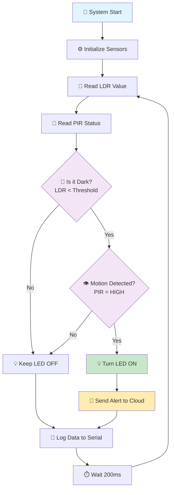

# 🏠 IoT Smart Security & Light Control System

<div align="center">


*An intelligent home automation system that detects motion and automatically controls lighting based on ambient conditions*

[🔗 Live Simulation](https://wokwi.com/projects/435817576047501313) | [📹 Demo Video](#demo-video) | [⚡ Quick Start](#quick-start)

</div>

---

## 🎯 **Aim**

To develop an intelligent IoT-based smart home automation system that enhances security and energy efficiency by automatically controlling lights based on motion detection and ambient light conditions, with real-time cloud monitoring capabilities.

---

## 📋 **Problem Statement**

Modern homes require intelligent automation systems that can:
- **Detect human presence** using motion sensors
- **Monitor ambient light conditions** to optimize energy consumption
- **Automatically control lighting** based on environmental conditions
- **Send real-time alerts** to cloud platforms for security monitoring
- **Operate efficiently** in low-light conditions for enhanced security

### **Challenge**: 
Create a system that continuously monitors the environment and responds intelligently to motion in dark conditions, providing both convenience and security while maintaining energy efficiency.

---

## 🔧 **Scope of the Solution**

### **Primary Features**
- 🔍 **Motion Detection**: PIR sensor for detecting human movement
- 💡 **Smart Lighting**: Automatic LED control based on ambient conditions
- 🌙 **Low-Light Detection**: LDR sensor for ambient light monitoring
- 📡 **Real-Time Monitoring**: Serial communication for status updates
- ⚡ **Energy Efficient**: Lights activate only when needed

### **Secondary Features**
- 🔔 **Alert System**: Cloud-ready alert notifications
- 📊 **Data Logging**: Sensor data monitoring and logging
- 🔄 **Continuous Operation**: Real-time environmental monitoring
- 🛡️ **Security Enhancement**: Motion detection in dark environments

---

## 🛠️ **Required Components**

### **Hardware Components**
| Component | Specification | Purpose |
|-----------|---------------|---------|
| 🖥️ **ESP32 DevKit-C-V4** | 32-bit MCU | Main controller with WiFi capability |
| 👁️ **PIR Motion Sensor** | HC-SR501 | Detect human movement |
| 🌞 **LDR (Light Sensor)** | Photoresistor | Monitor ambient light levels |
| 💡 **LED** | Red LED | Visual indicator/light control |
| ⚡ **Resistor** | 1kΩ | Current limiting for LED |
| 🔌 **Breadboard & Wires** | Standard | Circuit connections |

### **Software Requirements**
| Software | Version | Purpose |
|----------|---------|---------|
| 🔧 **Arduino IDE** | 2.0+ | Code development and upload |
| 📱 **ESP32 Board Package** | Latest | ESP32 support in Arduino IDE |
| 🌐 **WiFi Library** | Built-in | Network connectivity |
| ☁️ **Cloud Platform** | AWS IoT/ThingSpeak | Data logging and alerts |

### **Cloud Environment**
- **☁️ Cloud Platform**: AWS IoT Core / ThingSpeak / Blynk
- **📊 Database**: Time-series database for sensor data
- **📱 Mobile App**: Real-time monitoring dashboard
- **🔔 Notification Service**: SMS/Email alerts

---

## 📊 **System Flowchart**



### **🔄 Algorithm Flow**
1. **Initialization**: Configure PIR, LDR, and LED pins
2. **Continuous Monitoring**: Read sensor values every 200ms
3. **Condition Check**: Evaluate if environment is dark (LDR < threshold)
4. **Motion Detection**: Check for human presence using PIR sensor
5. **Smart Response**: Activate LED only when motion is detected in dark conditions
6. **Alert Generation**: Send cloud alerts for security monitoring
7. **Data Logging**: Record all sensor readings for analysis

---

## ⚡ **Quick Start**

### **1. Circuit Setup**
```
ESP32 Connections:
├── PIR Sensor (Pin 12)
├── LDR Sensor (Pin 13) 
├── LED + Resistor (Pin 2)
└── Power & Ground
```

### **2. Code Upload**
```bash
# Open Arduino IDE
# Select ESP32 DevKit-C board
# Upload sketch.ino to your ESP32
```

### **3. Monitor Output**
```
Serial Monitor Output:
LDR: 450 | PIR: 0
LDR: 320 | PIR: 1
Motion detected in dark! Sending alert...
```

---

## 🎮 **Wokwi Simulation**

### **🔗 Live Circuit Simulation**
Experience the project virtually: **[Wokwi Simulation Link](https://wokwi.com/projects/435817576047501313)**

### **🖼️ Circuit Diagram**

*ESP32-based Smart Security System with PIR and LDR sensors*

### **⚙️ Simulation Features**
- 🔄 **Real-time Interaction**: Click on PIR sensor to simulate motion
- 🌞 **Light Control**: Adjust LDR slider to change ambient light
- 📊 **Live Monitoring**: Watch serial output for system responses
- 💡 **Visual Feedback**: LED indicates system status

---

## 📹 **Demo Video**

### **🎥 System Demonstration**
[](https://youtube.com/watch?v=your-demo-video)

### **📋 Demo Highlights**
- ✅ Motion detection in various lighting conditions
- ✅ Automatic LED control based on ambient light
- ✅ Real-time serial monitoring
- ✅ Cloud alert simulation
- ✅ Energy-efficient operation

---

## 📈 **Future Enhancements**

| Feature | Description | Priority |
|---------|-------------|----------|
| 📱 **Mobile App** | Real-time monitoring dashboard | High |
| 🔔 **SMS Alerts** | Instant notifications for motion detection | High |
| 🏠 **Multi-Room Support** | Expand to multiple rooms | Medium |
| 🤖 **AI Integration** | Smart learning from user patterns | Medium |
| 🔋 **Battery Backup** | Uninterrupted operation during power cuts | Low |

---


</div>
